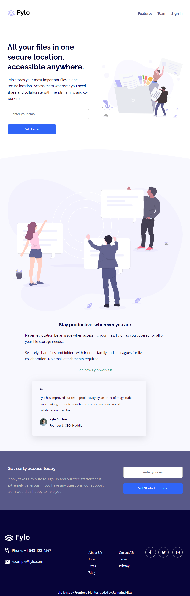

# Frontend Mentor - Fylo landing page with two column layout solution

This is a solution to the [Fylo landing page with two column layout challenge on Frontend Mentor](https://www.frontendmentor.io/challenges/fylo-landing-page-with-two-column-layout-5ca5ef041e82137ec91a50f5). Frontend Mentor challenges help you improve your coding skills by building realistic projects. 

## Table of contents

- [Overview](#overview)
  - [The challenge](#the-challenge)
  - [Screenshot](#screenshot)
  - [Links](#links)
- [My process](#my-process)
  - [Built with](#built-with)
  - [What I learned](#what-i-learned)
- [Author](#author)

## Overview

### The challenge

### Screenshot

#### Desktop


#### Tablet


#### Mobile


### Links

- Solution URL: [My solution URL](https://github.com/jannatulmitu03/fylo-landing-page)
- Live Site URL: [My live site URL](https://jannatulmitu03.github.io/fylo-landing-page)

## My process

### Built with

- Semantic HTML5 markup
- CSS custom properties
- Flexbox
- CSS Grid
- Form
- Card
- Background curved image
- Transform (translate)
- Transform (transition) 
- Pseudo element
- Desktop-first workflow


### What I learned


#### HTML Form
```html

 <form action="https://formspree.io/f/mgegpqpj"
 method="POST">
   <input type="email" placeholder="enter your email" name="your email"  class="email-input">
   <button type="submit" class="btn1">Get Started</button>
 </form>
```

#### CSS
#### Pseudo element
```css 

.icons-groups a i{
  font-size: 15px;
  color:var(--Light-Grayish-Blue);
  position: relative;
}

.icons-groups a i::after{
    content: "";
    width: 40px;
    height: 40px;
    border-radius: 50%;
    position: absolute;
    left: -15px;
    bottom: -13px;    
    border: 1px solid var(--Light-Gray);
    cursor: pointer; 
}
```
#### Transform (translate)
```css
.icons-groups{
    transform: translateY(50px);
}
```

#### Transform (transition)
```css
.icons-groups a i:hover{
    color: var(--Moderate-Cyan);
    transition: all .3s ease;
    }
```

## Author

- Website - [Jannatul Mitu](https://www.linkedin.com/in/jannatulmitu03)
- Frontend Mentor - [@jannatulmitu03](https://www.frontendmentor.io/profile/jannatulmitu03)
- Twitter - [@jannatulmitu03](https://twitter.com/jannatulmitu03)
